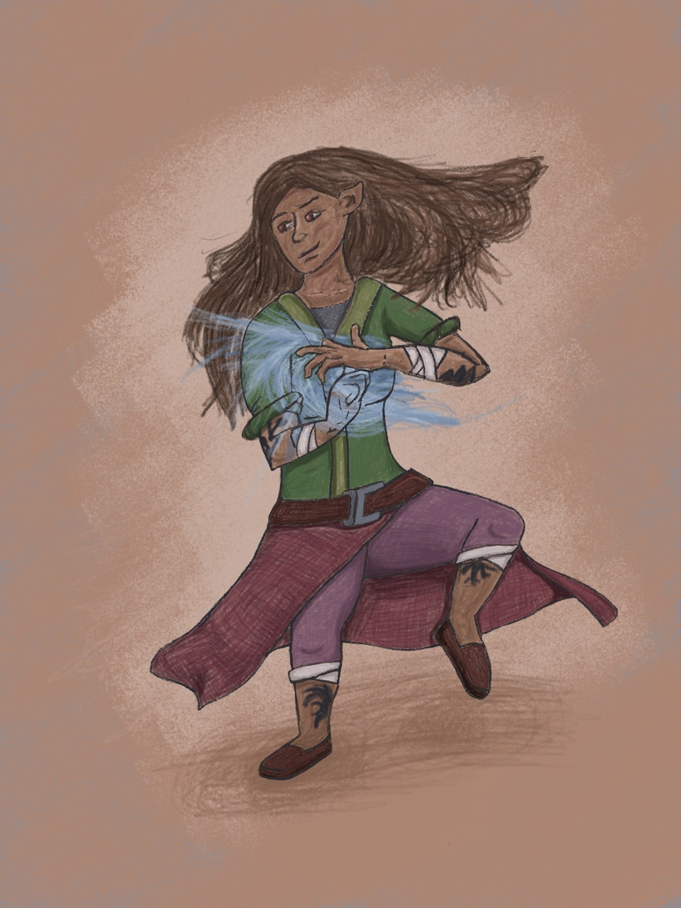
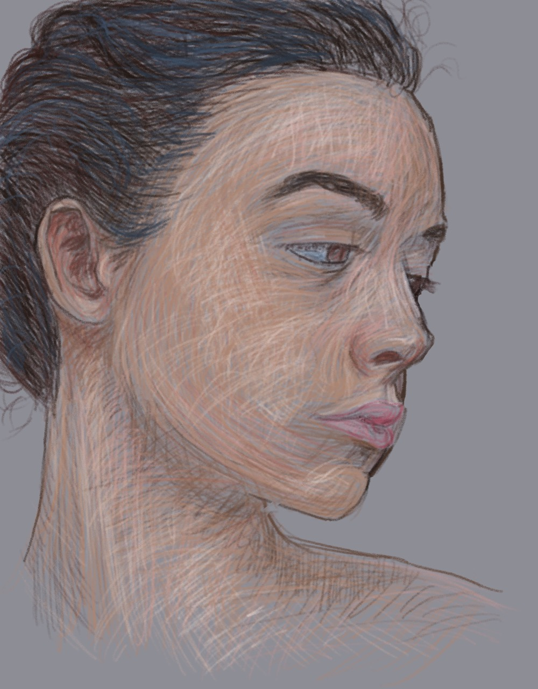
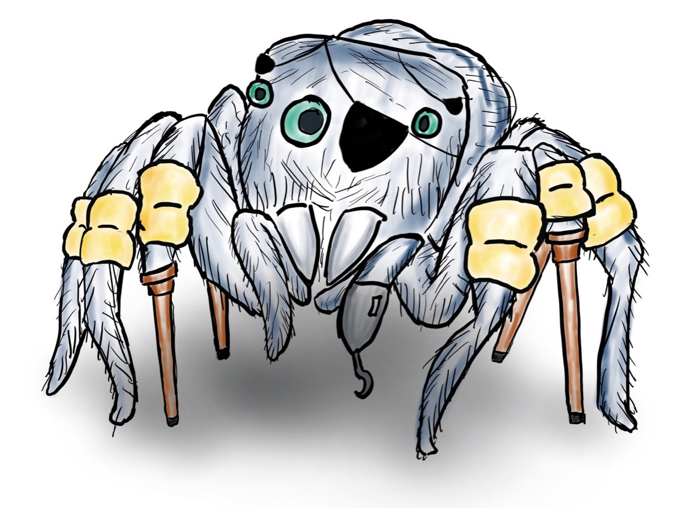
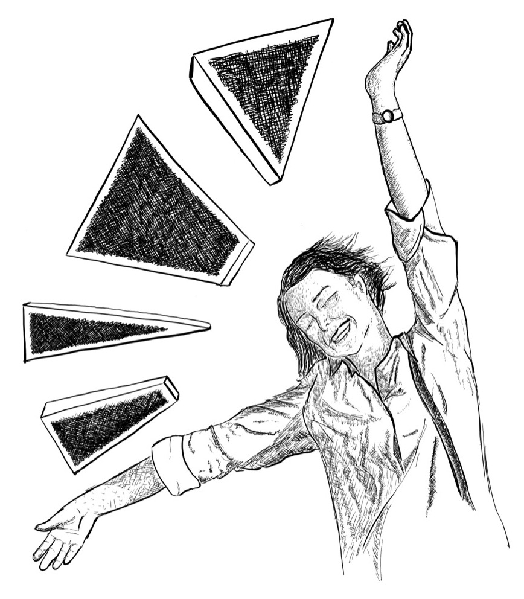
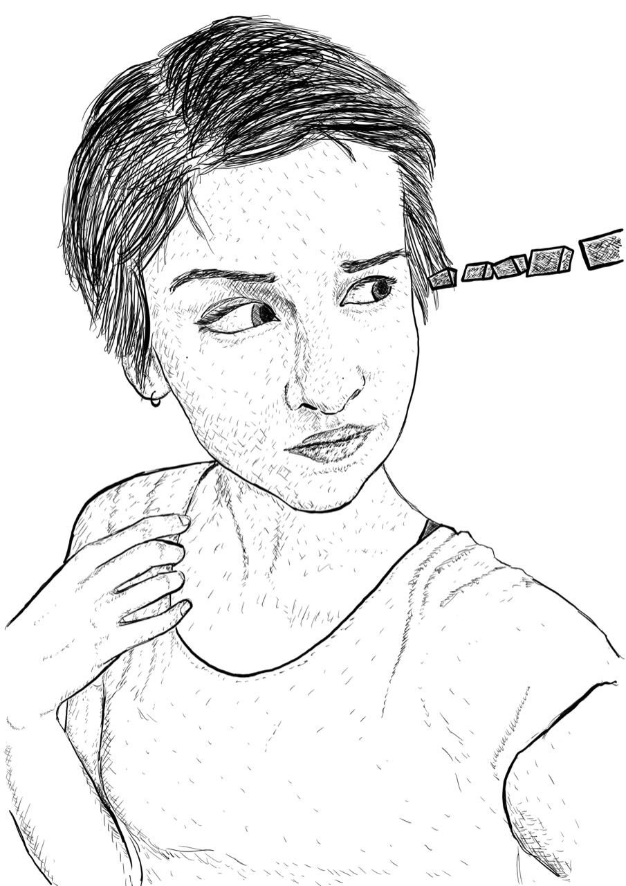
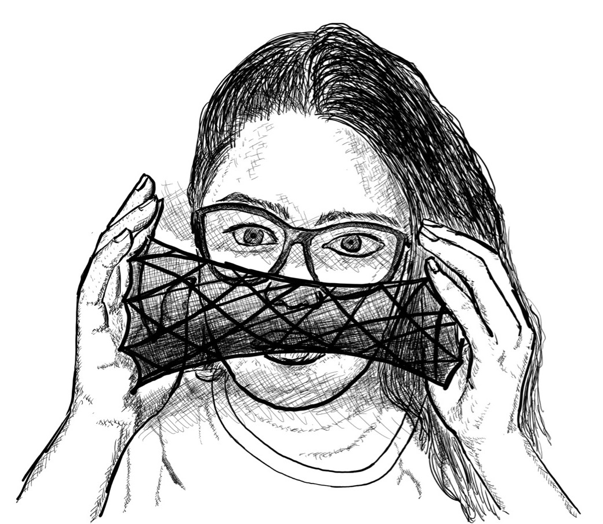

<figure>
	
    <figcaption>Kithri, a halfling monk character I played in a DnD campaign.</figcaption>
</figure>

<figure>
	
    <!-- <figcaption>Caption</figcaption> -->
</figure>

<figure>
	
    <figcaption>Spidey McPirateface, a character I created for a DnD campaign.</figcaption>
</figure>

<figure>
	
    <!-- <figcaption>Caption</figcaption> -->
</figure>

<figure>
	
    <!-- <figcaption>Caption</figcaption> -->
</figure>

<figure>
	
    <!-- <figcaption>Caption</figcaption> -->
</figure>
