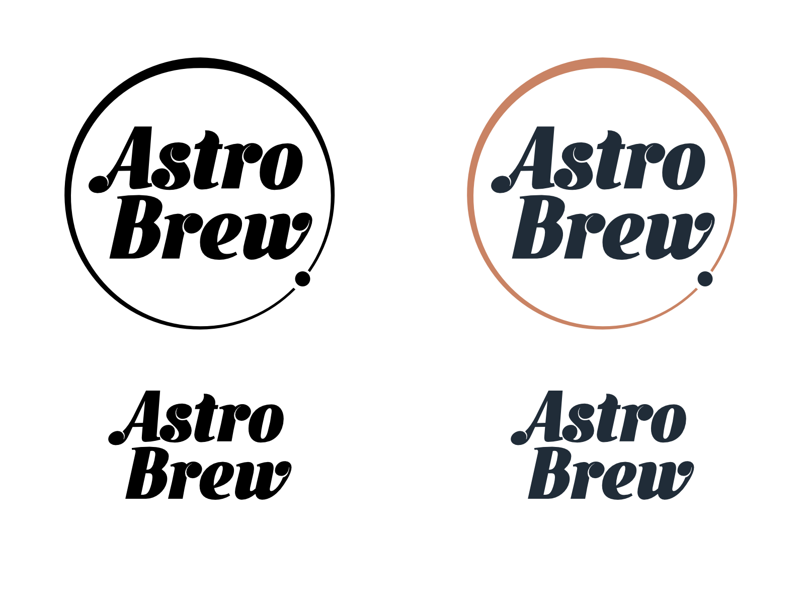

<figure>
	
    <figcaption>AstroBrew: Logo + Wordmark (Monotone and Color)</figcaption>
</figure>

AstroBrew is a silly and fun design experiment, designing labels for hypothetical astronomy themed beer brews.

<figure>
	
    <figcaption>Sgr Ale*: The darkest beer in the galaxy!</figcaption>
</figure>
