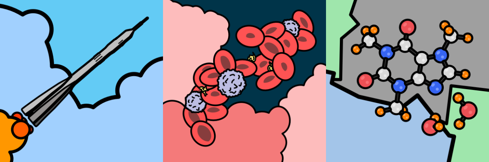
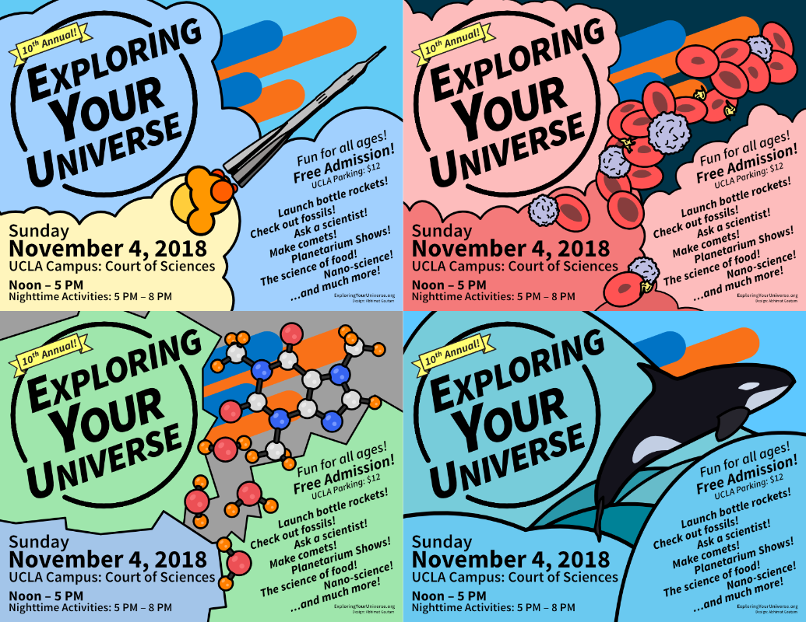
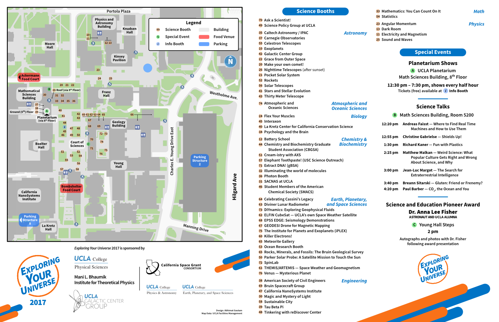
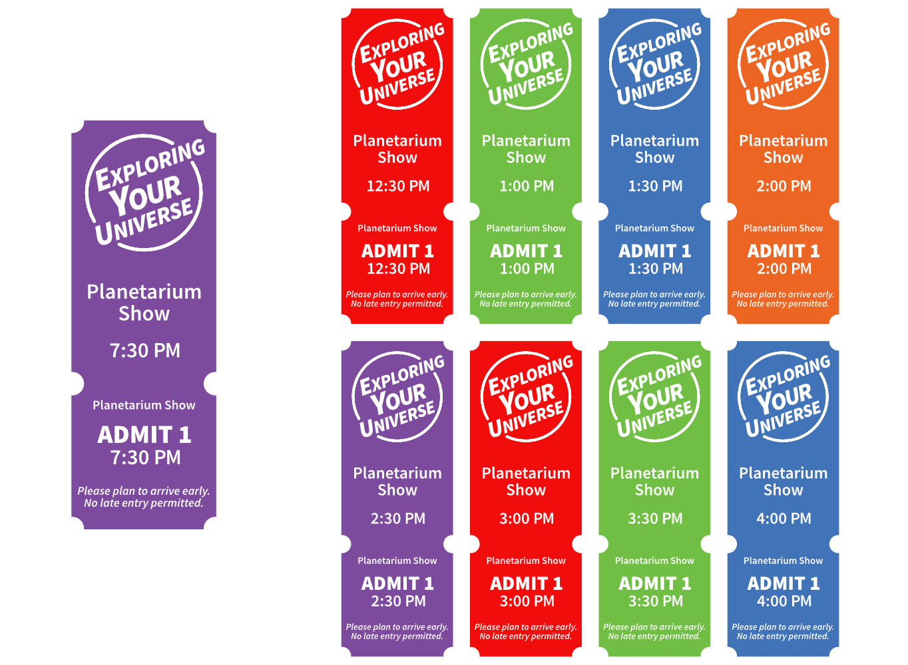
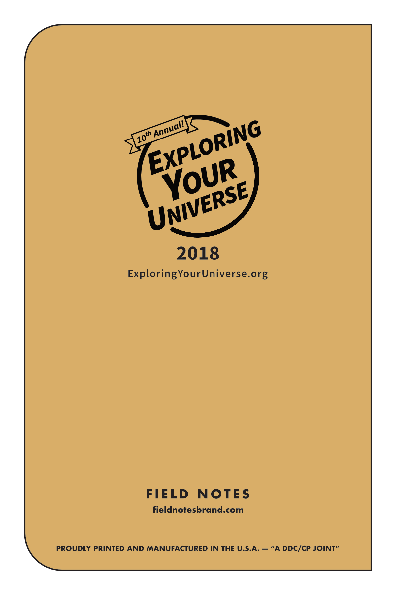

<figure>
	
    <figcaption>Exploring Your Universe: Logo</figcaption>
</figure>

Exploring Your Universe (EYU) is an annual science outreach day held on the UCLA campus. I led the design work for all aspects of EYU for 4 years, including logo, print, and art. It was the most extensive design project I've been involved in, and is one of my proudest works.

<figure>
	
    <figcaption>English and Español Logos</figcaption>
</figure>

<figure class="bleed">
	
    <figcaption>Art Squares</figcaption>
</figure>

<figure>
	
    <figcaption>Poster Designs</figcaption>
</figure>

<figure>
	
    <figcaption>Event Program</figcaption>
</figure>

<figure>
	
    <figcaption>Planetarium Tickets</figcaption>
</figure>

<figure>
	
    <figcaption>Custom [Field Notes](https://fieldnotesbrand.com) prototype for EYU 2018. These didn't pan out :(</figcaption>
</figure>

<figure>

</figure>