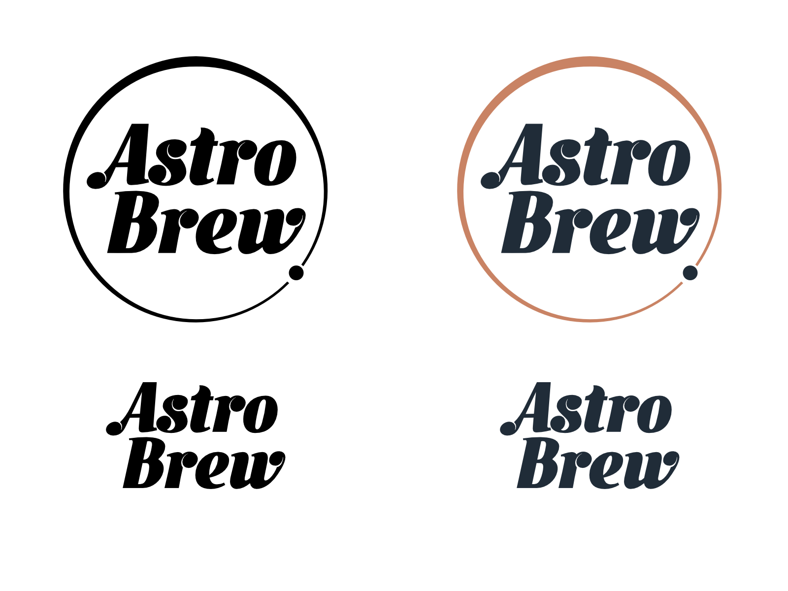

I love graphic design and typography, and I love dabbling in it. Here are some of my proudest designs.

## [Exploring Your Universe](./eyu/)

<figure>
	
    <figcaption>Exploring Your Universe: Logo</figcaption>
</figure>

---

## [Signs of Protest](./protest/)

<figure>
	
    <figcaption>Resist with Science</figcaption>
</figure>

---

## [Science Policy Group at UCLA](./ucla-scipol/)

<figure>
	
    <figcaption>Science Policy Group at UCLA: Logo + Wordmark</figcaption>
</figure>

---

## [AstroBrew](./astrobrew/)

<figure>
	
    <figcaption>AstroBrew: Logo + Wordmark (Monotone and Color)</figcaption>
</figure>

---

## Radial Infall

<figure>

<figcaption>Radial Infall Logo</figcaption>
</figure>

[Radial Infall](http://radialinfall.com) is a personal weblog project. This is a fun little logo I designed for it.

---

## Astronomy and Space

<figure>
	
    <figcaption>Astronomy and Space Logo</figcaption>
</figure>

Logo for my old blogging project, [Astronomy and Space](http://astronomyandspace.net). (I just really love Futura…)

---

## SciComm Hub

<figure>
	
    <figcaption>SciComm Hub: Logo + Wordmark</figcaption>
</figure>
