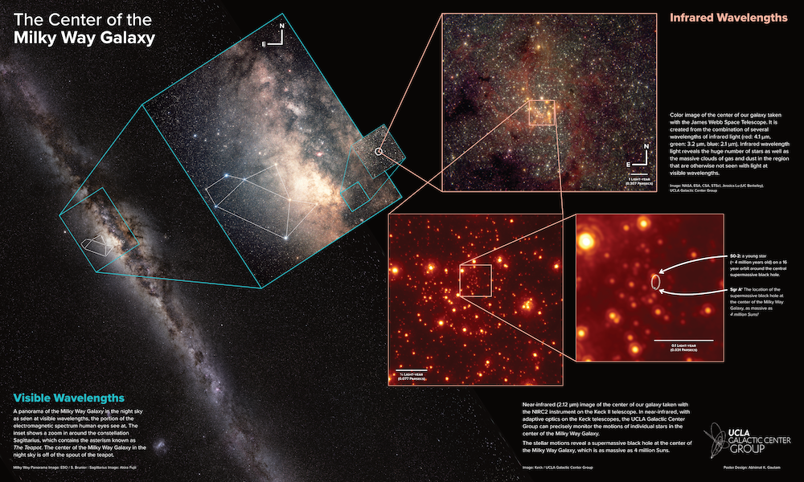
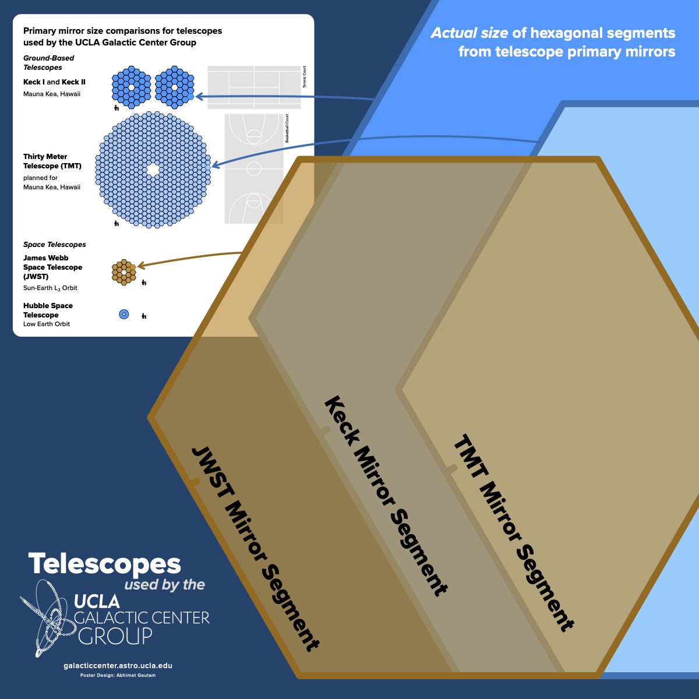
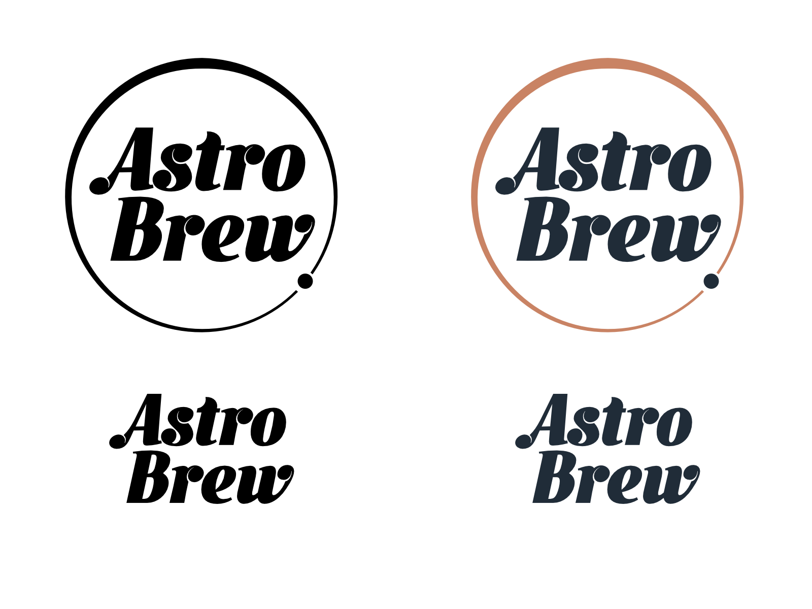

I love graphic design and typography, and I love dabbling in it. Here are some of my proudest designs.

## Educational Science Posters for General Public

### The Center of the Milky Way Galaxy

<figure>
	
    <figcaption>The Center of the Milky Way Galaxy</figcaption>
</figure>

A poster showing the location of the center of the Milky Way Galaxy, starting at visual wavelengths on the left and how to identify the location in the night sky. Then on the right side, the poster zooms into the very center regions in near-infrared images taken with JWST and Keck that can see through the dust in the plane of the Milky Way, ultimately down to the star S0-2 and its 16 year orbit around the supermassive black hole at Sgr A* at the center of the Milky Way Galaxy.

Full size poster:
* [PDF \(vector and high resolution images\)](./MWGC_poster/MilkyWayPoster_v5.pdf)
* [PNG \(rasterized\)](./MWGC_poster/MilkyWayPoster_v5.png)

### Telescopes used by the UCLA Galactic Center Group

<figure>
	
    <figcaption>Telescopes used by the UCLA Galactic Center Group</figcaption>
</figure>

A poster showing the primary mirror sizes of the different telescopes used currently and in the future by the UCLA Galactic Center Group. The poster is particularly meant to highlight the large sizes of telescopes required to be able to achieve the spatial resolution necessary to study the stars in the most central parts of the Galaxy. When this poster is printed at a size of 60 inches × 60 inches, the individual hexagonal telescope segments are represented at their actual physical size.

Full size poster:
* [PDF \(vector\)](./telescopes_GCG_poster/telescopes_poster_v4.pdf)
* [PNG \(rasterized\)](./telescopes_GCG_poster/telescopes_poster_v4.png)

---

## [Exploring Your Universe](./eyu/)

<figure>
	
    <figcaption>Exploring Your Universe: Logo</figcaption>
</figure>

[Materials](./eyu/) (posters, maps, etc.) designed for Exploring Your Universe.

---

## [Signs of Protest](./protest/)

<figure>
	
    <figcaption>Resist with Science</figcaption>
</figure>

---

## [Science Policy Group at UCLA](./ucla-scipol/)

<figure>
	
    <figcaption>Science Policy Group at UCLA: Logo + Wordmark</figcaption>
</figure>

---

## [AstroBrew](./astrobrew/)

<figure>
	
    <figcaption>AstroBrew: Logo + Wordmark (Monotone and Color)</figcaption>
</figure>

---

## Radial Infall

<figure>

<figcaption>Radial Infall Logo</figcaption>
</figure>

[Radial Infall](http://radialinfall.com) is a personal weblog project. This is a fun little logo I designed for it.

---

## Astronomy and Space

<figure>
	
    <figcaption>Astronomy and Space Logo</figcaption>
</figure>

Logo for my old blogging project, [Astronomy and Space](http://astronomyandspace.net). (I just really love Futura…)

---

## SciComm Hub

<figure>
	
    <figcaption>SciComm Hub: Logo + Wordmark</figcaption>
</figure>
