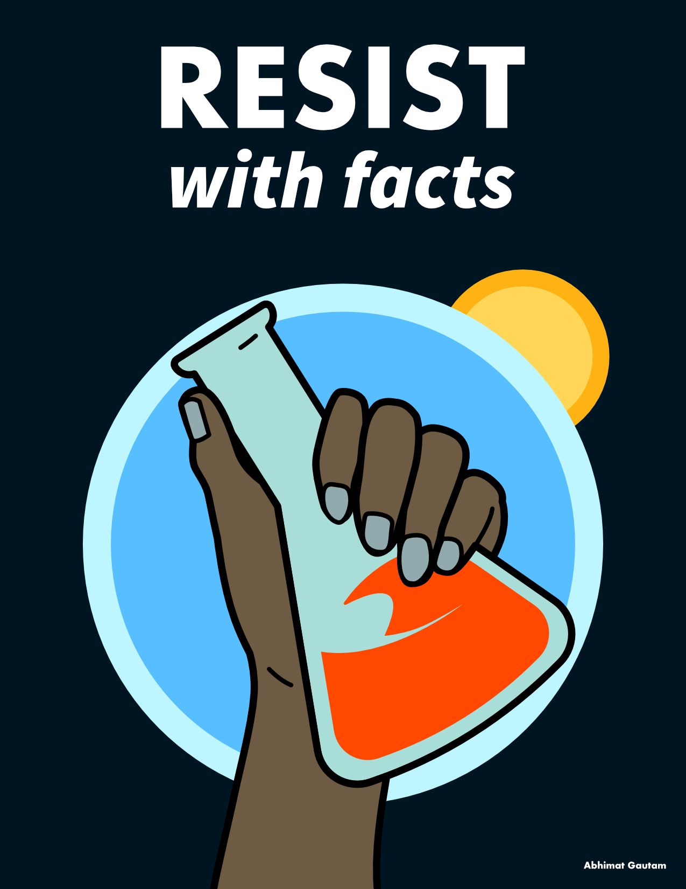
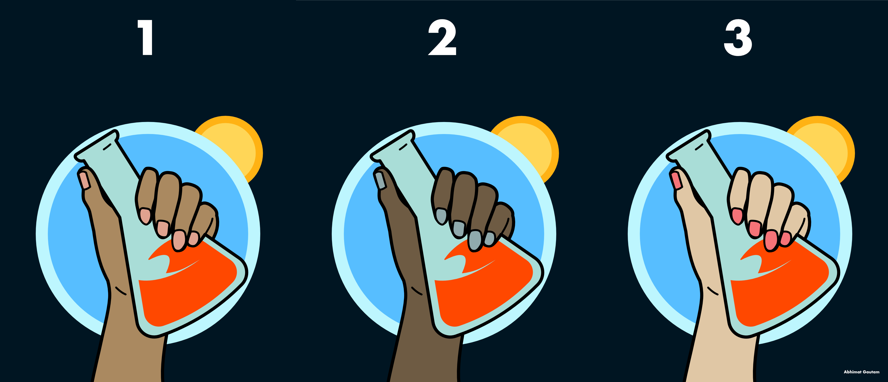
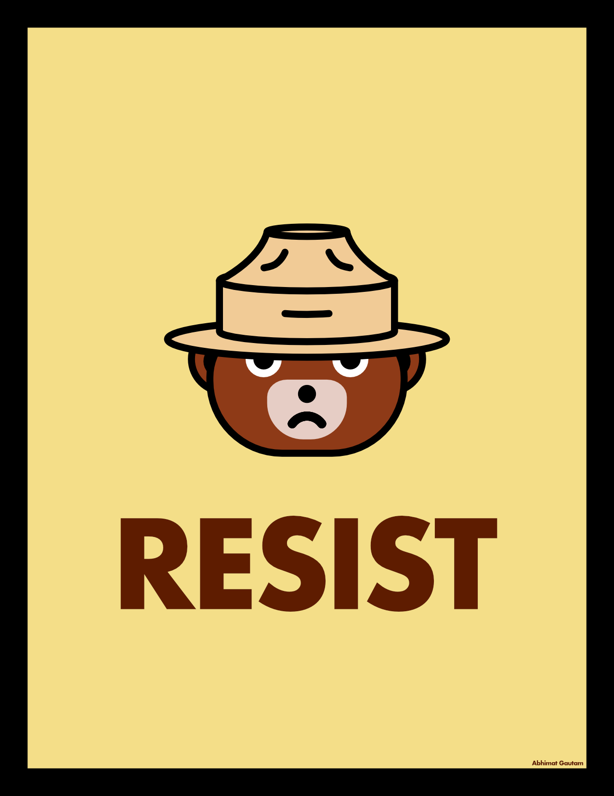
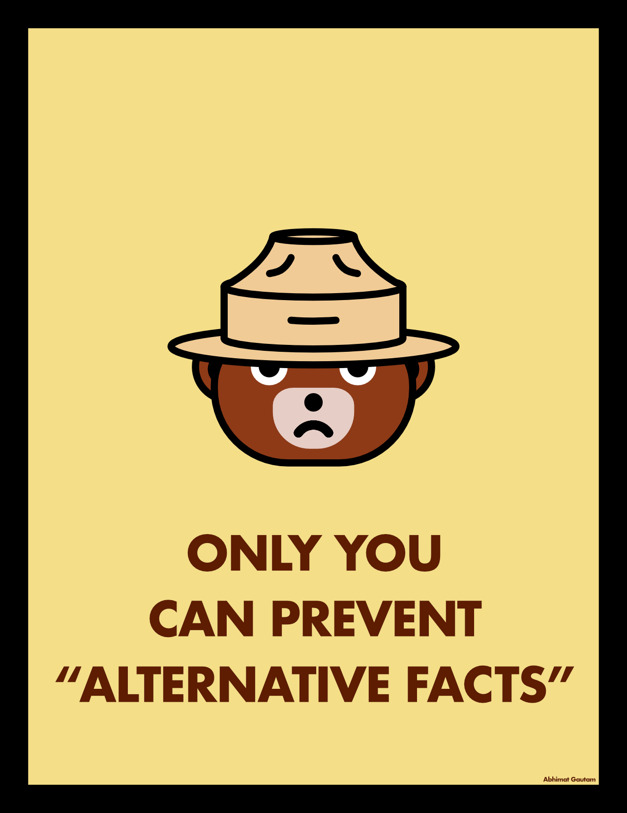
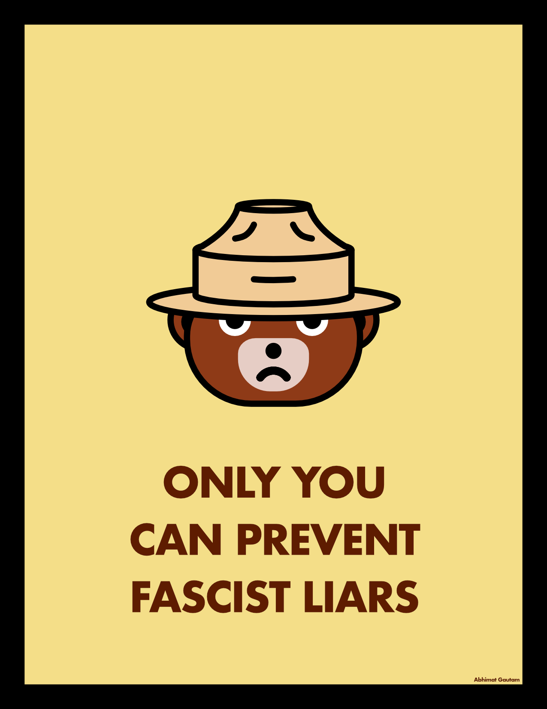

Protest poster designs, primarily created for the [March for Science](https://www.marchforscience.com). Suggestions welcome! Contact at [abhimat.gautam \[at\] gmail.com](mailto:abhimat.gautam@gmail.com)

## Resist Beaker

Download PDF: <a href="./resources/ResistWithScience_1.pdf">1</a>, <a href="./resources/ResistWithScience_2.pdf">2</a>, <a href="./resources/ResistWithScience_3.pdf">3</a> | Download PNG: <a href="./resources/ResistWithScience_1.png">1</a>, <a href="./resources/ResistWithScience_2.png">2</a>, <a href="./resources/ResistWithScience_3.png">3</a>

Download PDF: <a href="./resources/ResistWithFacts_1.pdf">1</a>, <a href="./resources/ResistWithFacts_2.pdf">2</a>, <a href="./resources/ResistWithFacts_3.pdf">3</a> | Download PNG: <a href="./resources/ResistWithFacts_1.png">1</a>, <a href="./resources/ResistWithFacts_2.png">2</a>, <a href="./resources/ResistWithFacts_3.png">3</a>

## Angry Smokey

<a href="./resources/SmokeyResist.pdf">Download PDF</a> | <a href="./resources/SmokeyResist.png">Download PNG</a>

<a href="./resources/SmokeyAltFacts.pdf">Download PDF</a> | <a href="./resources/SmokeyAltFacts.png">Download PNG</a>

<a href="./resources/SmokeyFascLiars.pdf">Download PDF</a> | <a href="./resources/SmokeyFascLiars.pdf">Download PNG</a>

---

 This work is licensed under a <a rel="license" href="http://creativecommons.org/licenses/by-nc-sa/4.0/">Creative Commons Attribution-NonCommercial-ShareAlike 4.0 International License</a>.