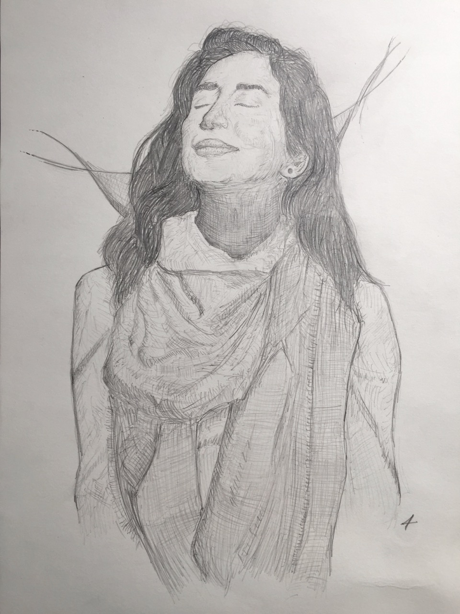

<figure class="bleed">
	
    <!-- <figcaption>Caption</figcaption> -->
</figure>

<figure>
	
    <!-- <figcaption>Caption</figcaption> -->
</figure>

<figure>
	
    <!-- <figcaption>Caption</figcaption> -->
</figure>

<figure class="bleed">
	
    <!-- <figcaption>Caption</figcaption> -->
</figure>

<figure>
	
    <!-- <figcaption>Caption</figcaption> -->
</figure>

<figure class="bleed">
	
    <!-- <figcaption>Caption</figcaption> -->
</figure>

<figure class="bleed">
	
    <!-- <figcaption>Caption</figcaption> -->
</figure>

<figure>
	
    <!-- <figcaption>Caption</figcaption> -->
</figure>

<figure>
	
    <!-- <figcaption>Caption</figcaption> -->
</figure>