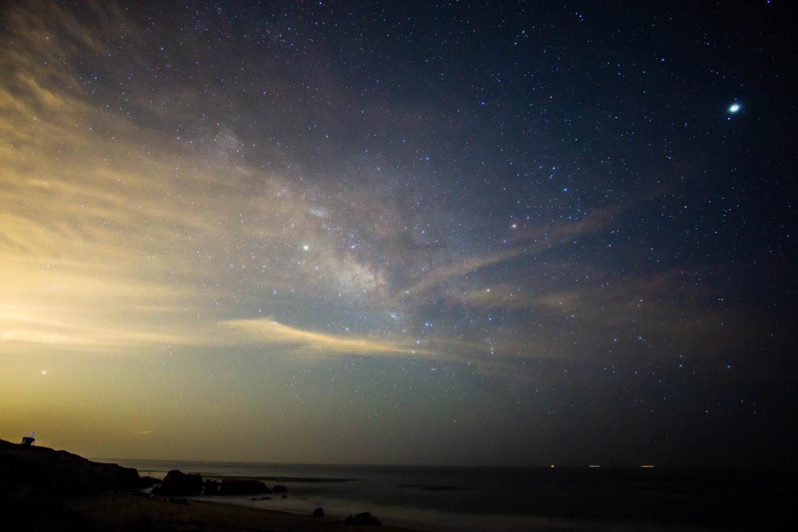
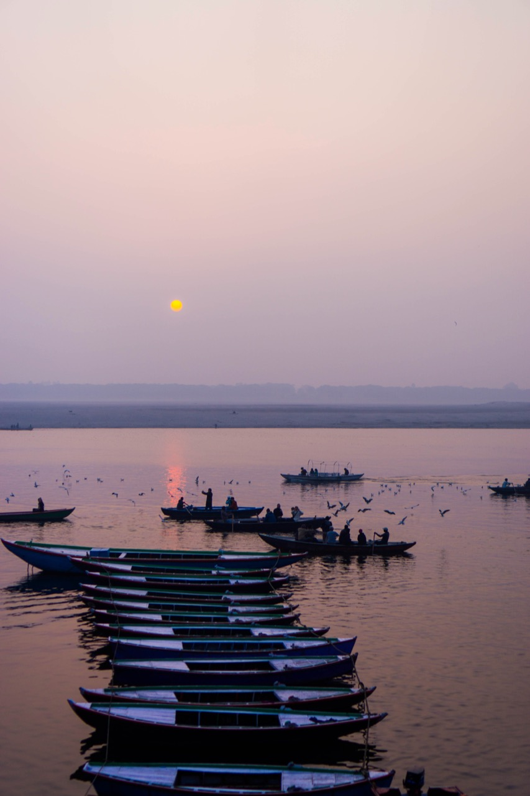
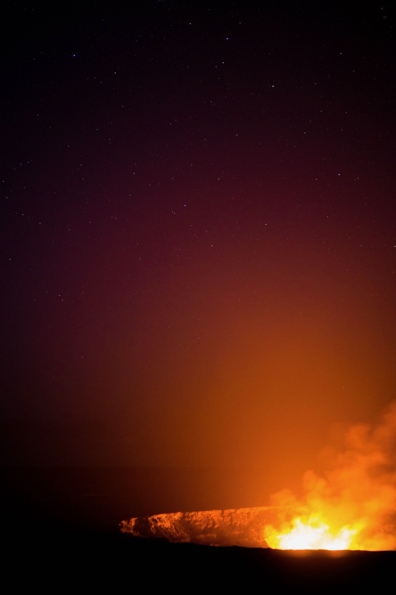
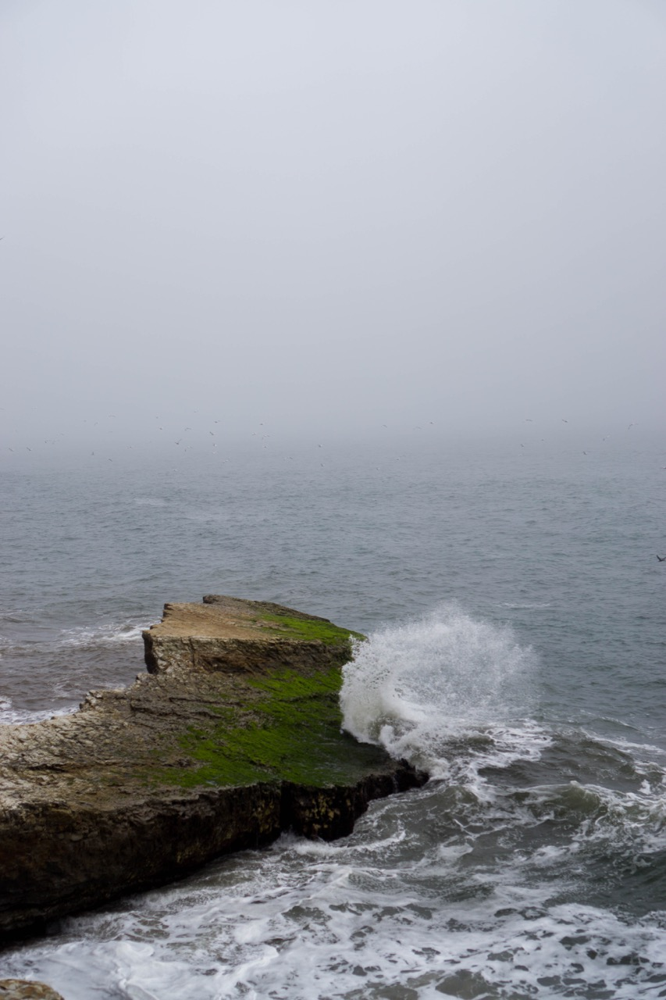
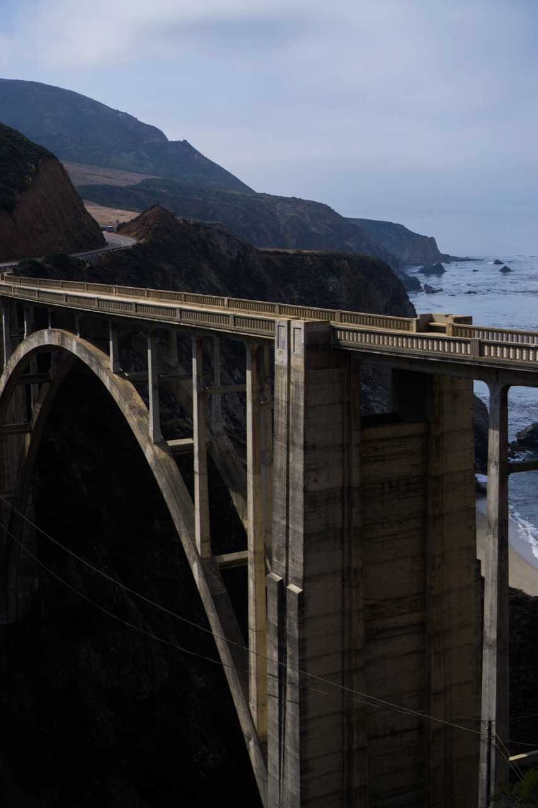
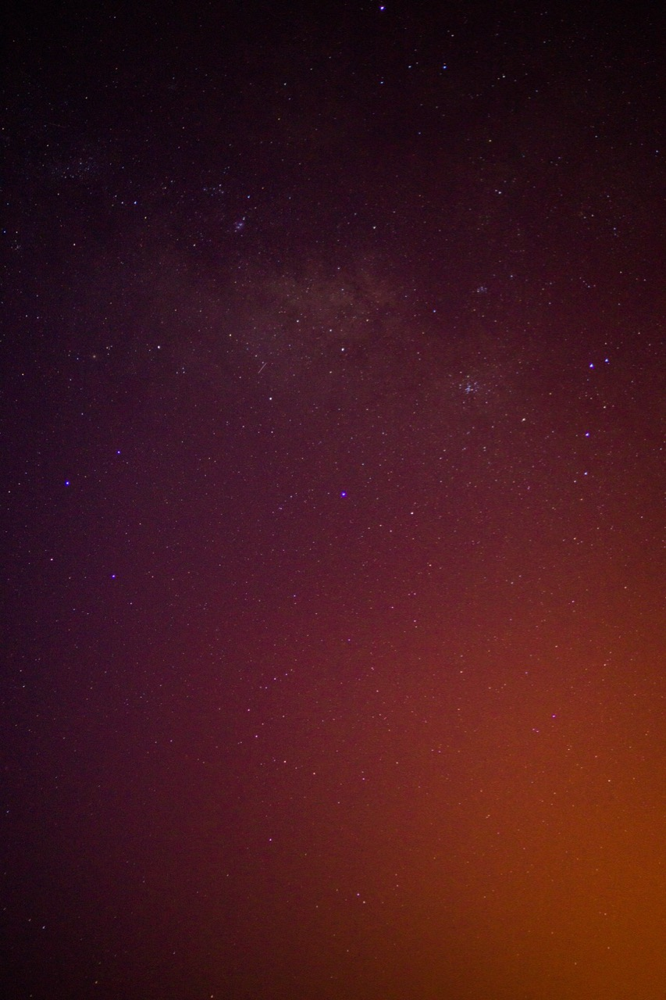
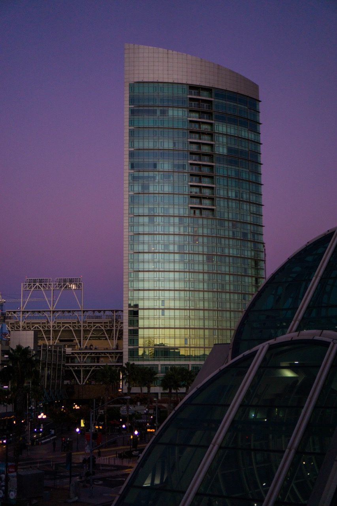
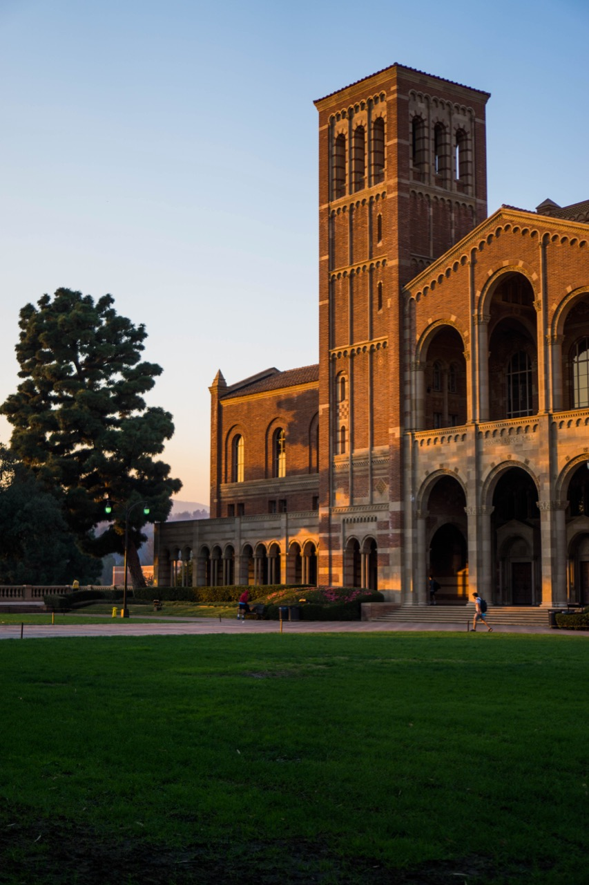
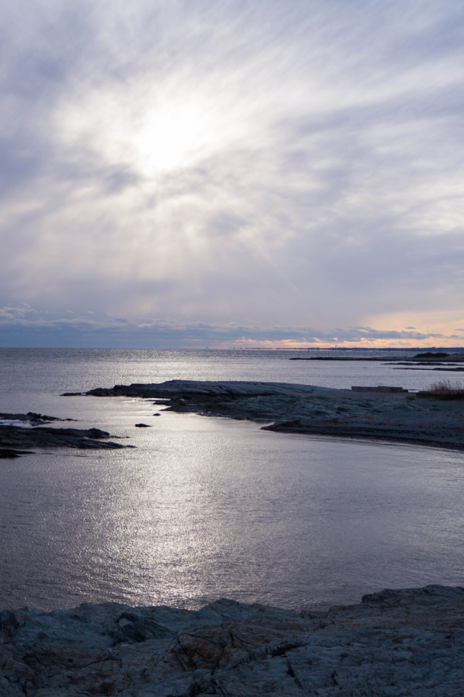
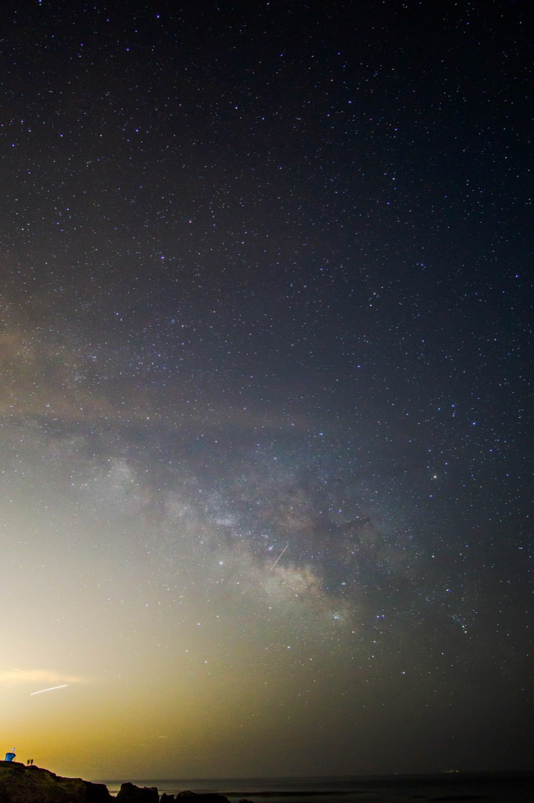

I love photography, and am slowly improving my skills. These photos were taken with my Sony A6000 camera.

<figure class="bleed">
	
    <figcaption>The Milky Way rising over Leo Carrillo State Beach</figcaption>
</figure>

<figure>
	
    <figcaption>Sunrise over the Ganga, in my hometown of Varanasi</figcaption>
</figure>

<figure>
	
    <figcaption>Volcanoes National Park</figcaption>
</figure>

<figure>
	
    <figcaption>California Coast</figcaption>
</figure>

<figure>
	
    <figcaption>Bixby Creek Bridge, Big Sur, California</figcaption>
</figure>

<figure>
	
    <figcaption>The center of the Galaxy, visible over Volcanoes National Park</figcaption>
</figure>

<figure>
	
    <figcaption>San Diego</figcaption>
</figure>

<figure>
	
    <figcaption>UCLA</figcaption>
</figure>

<figure>
	
    <figcaption>Rhode Island Coast</figcaption>
</figure>

<figure>
	
    <figcaption>The Milky Way over Leo Carrillo State Beach</figcaption>
</figure>