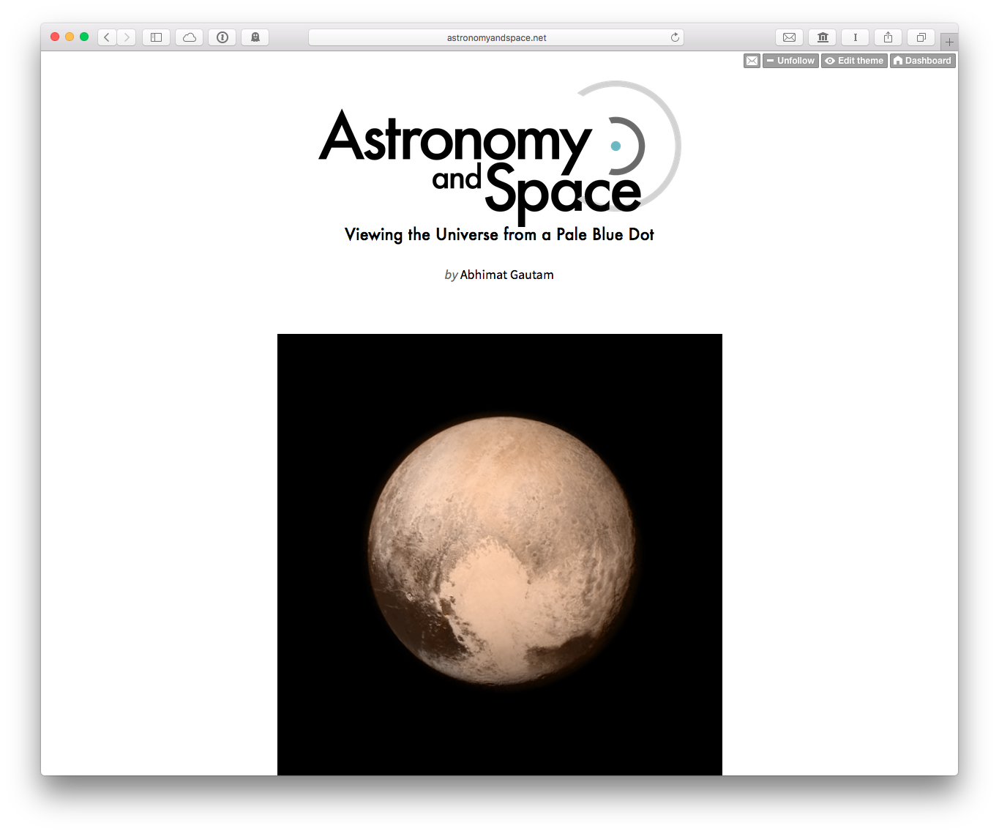
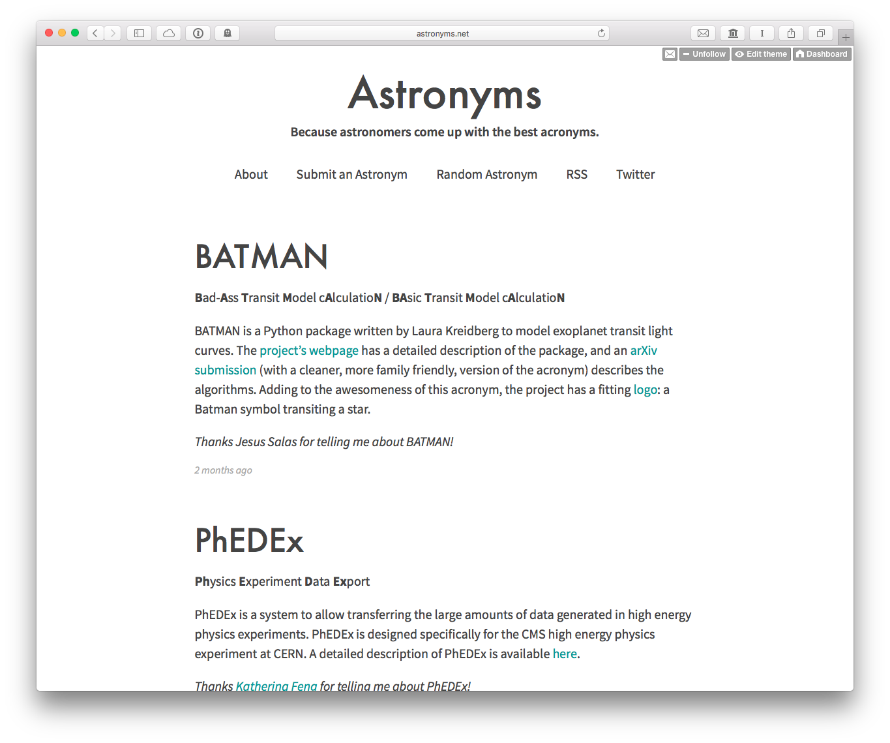
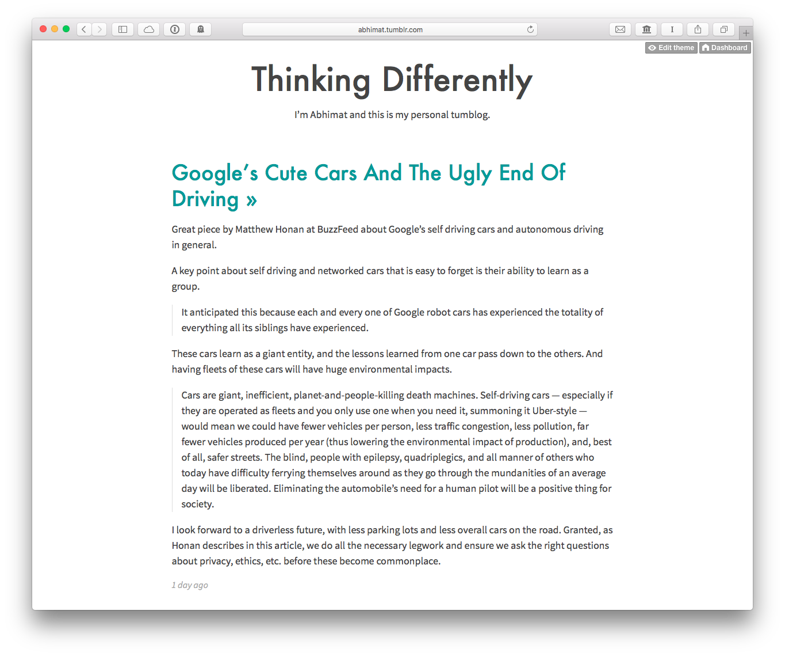

## Blogs

### [Astronomy and Space](http://astronomyandspace.net/)

Astronomy and Space is, in short, where I share a record of my adventures in learning more about the universe. One of the best ways I learn is by sharing what I learn with someone else. This blog, over the past few years, has inadvertenly become one of my outlets to do that.

If you’re new to the blog, I put together a list of my favorite posts [here](http://astronomyandspace.net/about) that I feel are fantastic to get started with.

### [Astronyms](http://astronyms.net/)

I noticed that astronomers often come up with some of the most clever (or convoluted, if you will) acronyms, so I recently decided to make a tumblog gathering my favorites all in one place. You can even [submit](http://astronyms.net/submit) your own!

### [Thinking Differently](http://abhimat.tumblr.com/)

Thinking Differently is simply my personal log. It’s where I post anything miscellaneous that I find interesting. It mostly consists of what I’ve been reading lately on the web, primarily collected through Instapaper. From time to time, I also like to publish short essays. I write these to help drain my thoughts on something important bouncing inside my head, and sometimes I feel that they are coherent enough and relevant enough to publish. These are collected [here](http://abhimat.tumblr.com/tagged/essays).