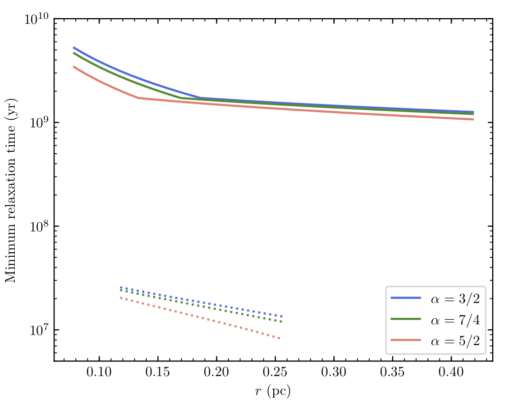

**[Download a copy of the poster](./Poster_Print.pdf)** (Keck Science Meeting, September 2019)

Stay tuned for our final results in an upcoming paper: **Gautam+ (in prep.)**

Initial discovery of old binary, and methodology for deriving precise photometry from Galactic center Keck AO imaging data: **[Gautam+ (2019)](https://ui.adsabs.harvard.edu/abs/2019ApJ...871..103G/abstract)**

Contact for questions and comments: [abhimat [at] astro.ucla.edu](mailto:abhimat@astro.ucla.edu)

---

## Photometric observations and discovery of periodic variability

The discovery is based on photometric measurements of stars in the central 10 arcseconds of the Milky Way Galactic center (GC), corresponding to a projected distance of approximately 0.4 parsecs. These photometric measurements are derived from imaging data taken with Keck observatory NIRC2 laser guide star adaptive optics (AO) observations of the Galactic center, with observations spanning from 2006 to 2019. Observations were performed in near-infrared, in *K\'*-band (2.124 µm; 59 nights, 2006–2019) and in *H*-band (1.633 µm; 12 nights, 2017–2019).

The methodology to derive precise photometry from GC AO imaging data is described in [Gautam+ (2019)][Gautam+2019]. The paper presents the photometric dataset in *K\'* spanning 2006–2017 (45 nights). The photometry methodology includes selecting stable calibrator stars distributed throughout the 10 arcsecond field of view, and a local photometric correction process to account for photometric measurement biases introduced by PSF variability across the field of view. Our photometric methods achieve approximately 3% photometric precision across the observing time baseline for stars as faint as magnitude 15 in *K\'*. Our total sample of stars studied in this project was 563 stars.

In [Gautam+ (2019)][Gautam+2019], we performed a periodicity search on all 563 stars in our sample. This periodicity search identified the two known eclipsing binary systems at the GC: IRS 16SW and S4-258. The search also identified a new detection of periodic photometric variability in the star S2-36. S2-36 has a photometric variability period of 39.43 days.

<figure class="text">
	
    <figcaption><em>K'</em> observations of S2-36, folded to photometric period of approximately 39.4 days. The top panel shows the location of S2-36 on the field of view, highlighted as a red circle. The location of the supermassive black hole, at Sgr A*, is shown as the white star symbol. S2-36 is located about 2 arcseconds away from the position of Sgr A*, corresponding to a projected distance of approximately 0.08 pc. (Gautam+ 2019)</figcaption>
</figure>

<figure class="text">
	
    <figcaption>Significance of periodicity detection of GC stars in Gautam+ (2019) sample. The two known eclipsing binaries, IRS 16SW and S4-258, were detected significantly, as well as a newly detected periodic variable, S2-36. (Gautam+ 2019)</figcaption>
</figure>

[Gautam+2019]: https://ui.adsabs.harvard.edu/abs/2019ApJ...871..103G/abstract

## Periodic variability most consistent with a red giant, ellipsoidal binary at the Galactic center

To determine the astrophysical cause of variability, we used additional observations taken in *H*-band to obtain an estimate of the observed color of the periodic star.

<figure class="text">
	
    <figcaption>Measurement of near-infrared color for the star S2-36, using observations in <em>K'</em> and in <em>H</em>. The blue line and bands represent the mean magnitude and uncertainty, respectively, at each wavelength band. (Gautam+ in prep.)</figcaption>
</figure>

Combining observations of the observed flux and color, we tested known sources of periodic variability at the observed photometric variability period: 2nd, 3rd, and 4th order pulsations in giants, Type I and Type II Cepheids, and red giant ellipsoidal binaries (aka sequence E variable). Each of these known sources of periodic variability have well-measured period-luminosity relationships (PLRs) in near-infrared, predicting intrinsic color and luminosity at the observed period. Comparing the observed color with the intrinsic color estimates a line-of-sight extinction towards the star, while the comparing the observed flux with the luminosity and extinction estimates a distance to the star. From these PLRs, the distance and extinction is most consistent with the GC under the red giant ellipsoidal binary (sequence E) hypothesis. The next closest hypothesis, Type II Cepheid, is inconsistent with GC distance by more than 3 sigma.

<figure class="text">
	
    <figcaption>Distance and extinction estimates from the observed S2-36 color under the red giant ellipsoidal binary hypothesis (red) and the Type II cepheid hypothesis (blue). The star's observed colors are most consistent with the Galactic center under the ellipsoidal binary hypothesis. (Gautam+ in prep.)</figcaption>
</figure>

## Binary light curve modeling: two red giants, with one 

We have built new software ([PHOEBE Phitter](https://github.com/abhimat/phoebe_phitter)) to model the observed light curve of S2-36 in *K\'*- and *H*-band to estimate physical parameters of the stars making up the binary system. We use [PHOEBE2](http://phoebe-project.org) to generate model binary systems and light curves. We derive stellar parameters of the binary components using [PopStar](https://github.com/astropy/PopStar). We draw stellar parameters and synthetic photometry from isochrones generated at stellar ages spanning 1 Gyr to 13.5 Gyr, and with metallicities between [Fe/H] = –1.5 and [Fe/H] = 0.5.

Best-fit binary models consist of an evolved red giant branch primary (radius approximately 34 solar radii, mass approximately 0.8 solar masses), a less-evolved secondary (radius approximately 13 solar radii, mass approximately 0.8 solar masses). The binary orbits have a semi-major axis of approximately 0.45 AU. To adequately fit the observed light curve, the binary light curves need a large tidally distorted primary (which gives the sinusoidal variations in light curve) and a smaller red giant (which gives the eclipses in the light curves). Notably, the sinusoidal variation in the more evolved giant are not enough to account for the total amplitude in the light curves.

<figure class="text">
	
    <figcaption>S2-36 observations (shown in black) with a model binary light curve (shown in red). This model light curve is generated with stellar parameters drawn from a 12.8 Gyr, [Fe/H] = –1.0 isochrone. (Gautam+ in prep.)</figcaption>
</figure>

<figure class="text">
	
    <figcaption>Mesh model for the binary model used to generate the model light curve shown above. Both components have similar masses. The larger component is tidally distorted by the second, smaller component. (Gautam+ in prep.)</figcaption>
</figure>

## Constraints on a "dark cusp"

### Dynamical relaxation and cusps
Our galaxy has a supermassive black hole that is lower in mass when compared to the central black holes in many other galaxies. A consequence of the low mass of the black hole is that it lowers the *dynamical relaxation* time for a stellar cluster that lives around it.

From dynamical models, we expect that such relaxed populations, if they exist around a central black hole that periodically eats stars, should exhibit a steep increase in stellar density towards the center. From Bahcall and Wolf dynamical models, if we model the density as a power law (density distribution, n(r), goes as r^(-alpha)), we expect an exponent somewhere between alpha = 7/4 to alpha = 3/2. This density profile is called a *cusp*.

Observationally, there is not strong evidence for such a cusp with old, late-type stars at the Galactic center, which should have had enough time to dynamically relax (see, e.g.: [Do+ 2013](https://ui.adsabs.harvard.edu/abs/2013ApJ...779L...6D/abstract), [Gallego-Cano+ 2018](https://ui.adsabs.harvard.edu/abs/2018A&A...609A..26G/abstract)).

### Dark Cusp
There has also been proposed a *dark cusp*, consisting of about 10,000 stellar mass black holes, each with individual masses on the order of 10 solar masses. These black holes would be remnants of recent episodes of star formation that took place less than a Gigayear ago. It’s expected that these black holes would have had sufficient time to reach relaxation around our black hole. Once this population has relaxed, we would also expect them to form a cusp, with density rising rapidly towards the center.

The challenge for this type of cusp is that it is not luminous, and difficult to verify and constrain directly. Recent observations in X-ray of quiescent X-ray binaries at further distances are consistent with a cusp ([Hailey+ 2018](https://ui.adsabs.harvard.edu/abs/2018Natur.556...70H/abstract)), but this study did not look close to the central black hole, within the central 0.2 parsecs, so their constraints are limited at smaller distances to the black hole.

### Testing a dark cusp with binary evaporation
A dark cusp can also be probed *binary evaporation* (see e.g.: [Alexander+Pfuhl 2014](https://ui.adsabs.harvard.edu/abs/2014ApJ...780..148A/abstract)): If you have a younger binary system with more massive stars or tighter separation, you would expect that such a binary system would be less susceptible to evaporation from the high stellar densities that you get from a cusp. On the other hand, if you have an older binary system, with less massive or further separated components, the binary system becomes much more easily able to evaporate from the high densities from a cusp. Essentially an older binary system has had more chances to be susceptible to evaporation from the environment density over the course of its lifetime.

This idea has been applied to the longest period binary that we know of in the galactic center so far: IRS 16NE (224 day binary period, approximately 6 Myr age). With the long period, it is much further separated, but they find that with this particular binary they were not able to place tight constraints on the cusp. This is a young, massive binary system, and therefore has had less opportunities for evaporation from the cusp.

### An old binary system places tighter constraints on the dark cusp
With an old binary system, tighter constraints can be placed on the dark cusp. Specifically, we derived limits on the *minimum relaxation time* for the dark cusp population, and *maximum density* and *maximum number* (within S2-36's orbit around the central supermassive black hole) of dark cusp members. S2-36's survival as an old binary implies that the maximum number of 10 solar mass objects within 0.25 parsecs is on the order of 1000.

<figure class="text">
	
    <figcaption>S2-36 constraints on minimum relaxation time (solid lines) and IRS 16NE constraints on minimum relaxation time (dashed lines). S2-36 gets constraints that are about 2 orders of magnitude larger on the relaxation time than those by IRS 16NE. (Gautam+ in prep.)</figcaption>
</figure>

<figure class="text">
	
    <figcaption>S2-36 constraints on density of dark cusp members (solid lines) and IRS 16NE constraints on density of dark cusp members (dashed lines). S2-36 gets constraints that are about 3 orders of magnitude tighter than those by IRS 16NE. (Gautam+ in prep.)</figcaption>
</figure>

<figure class="text">
	
    <figcaption>S2-36 constraints on number of dark cusp members (solid lines) and IRS 16NE constraints on number of dark cusp members (dashed lines), within these binaries respective orbits around the supermassive black hole. S2-36 gets constraints that are about 3–4 orders of magnitude tighter than those by IRS 16NE. (Gautam+ in prep.)</figcaption>
</figure>

<figure class="text">
	
    <figcaption>S2-36 softness parameter (solid lines) and IRS 16NE softness parameter (dashed lines). S2-36 is a <em>soft</em> binary system, so it is very sensitive to evaporation from interactions with surrounding members in the nuclear star cluster. (Gautam+ in prep.)</figcaption>
</figure>

These calculations were performed with assuming dark cusp members have masses of 10 solar masses. The possible distances (r) of the binaries S2-36 and IRS 16NE from the supermassive black hole are determined by astrometric measurements of each star. Minimum possible distance is determined by the projected distance to Sgr A*. The maximum possible distance is determined by where the projected velocity can still remain gravitationally bound to the central supermassive black hole.

**Stay tuned for our final results in an upcoming paper: Gautam+ (in prep.)!**