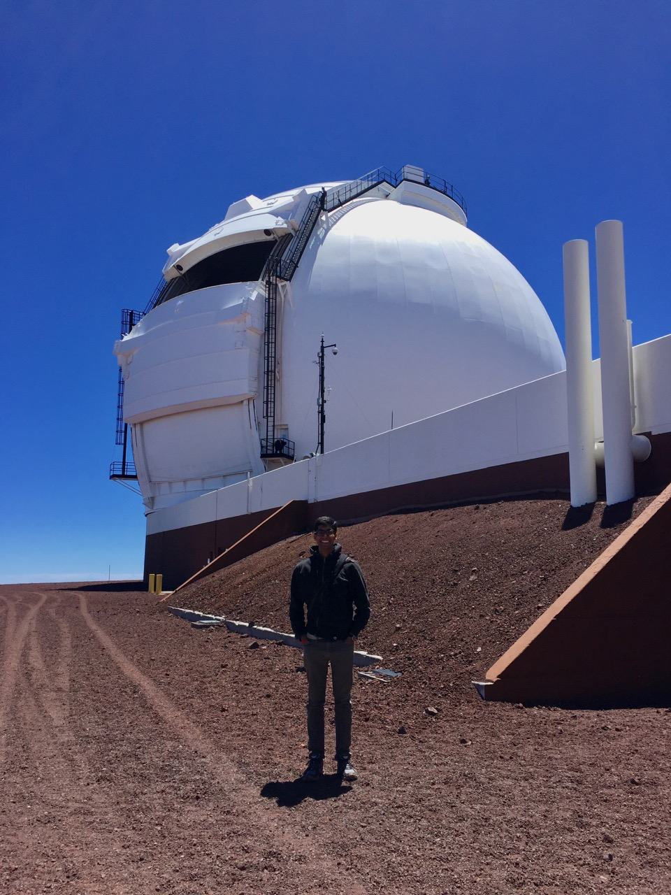

## Publications

### First-author
* **A. K. Gautam**, T. Do, A. M. Ghez, et al. *An Adaptive Optics Survey of Stellar Variability at the Galactic Center* Journal Link: [ApJ, 871:103, 2019](https://doi.org/10.3847/1538-4357/aaf103) \| Open Access: [arXiv:1811.04898](https://arxiv.org/abs/1811.04898)

### Co-authored
* Z. Chen, et al. *Consistency of the Infrared Variability of Sgr A\* over 22 yr* Journal Link: [ApJL, 882:L28, 2019](https://doi.org/10.3847/2041-8213/ab3c68) \| Open Access: [arXiv:1908.08066](https://arxiv.org/abs/1908.08066)
* T. Do, G. Witzel, **A. K. Gautam**, et al. *Unprecedented Near-infrared Brightness and Variability of Sgr A\** Journal Link: [ApJL, 882:L27, 2019](https://doi.org/10.3847/2041-8213/ab38c3) \| Open Access: [arXiv:1908.01777](https://arxiv.org/abs/1908.01777)
* T. Do, et al. *Relativistic redshift of the star S0-2 orbiting the Galactic center supermassive black hole* Journal Link: [Science, 16 Aug 2019](https://science.sciencemag.org/cgi/doi/10.1126/science.aav8137) \| Open Access: [arXiv:1907.10731](https://arxiv.org/abs/1907.10731)
* S. Jia, et al. *The Galactic Center: Improved Relative Astrometry for Velocities, Accelerations, and Orbits near the Supermassive Black Hole* Journal Link: [ApJ, 873:9, 2019](https://doi.org/10.3847/1538-4357/ab01de) \| Open Access: [arXiv:1902.02491](https://arxiv.org/abs/1902.02491)
* S. Sakai, et al. *The Galactic Center: An Improved Astrometric Reference Frame for Stellar Orbits around the Supermassive Black Hole* Journal Link: [ApJ, 873:65, 2019](https://doi.org/10.3847/1538-4357/ab0361) \| Open Access: [arXiv:1901.08685](https://arxiv.org/abs/1901.08685)
* D. S. Chu, et al. *Investigating the Binarity of S0-2* Journal Link: [ApJ, 854:12, 2018](https://doi.org/10.3847/1538-4357/aaa3eb) \| Open Access: [arXiv:1709.04890](https://arxiv.org/abs/1709.04890)

### Conference talks and proceedings
* **A. K. Gautam**, T. Do, A. M. Ghez, et al. *Photometric detection of a candidate low-mass giant binary system at the Milky Way Galactic Center* [AAS 231, 2018 January](http://adsabs.harvard.edu/abs/2018AAS...23121201K)
* **A. K. Gautam**, T. Do, A. M. Ghez, et al. *Constraining the Variability and Binary Fraction of Galactic Center Young Stars* [IAU Symposium 322, 2016 July](https://arxiv.org/abs/1610.02441)
* **A. K. Gautam**, A. Siemion, E. J. Korpela, et al. *SETI Searches for Radio Transients from Kepler Field Planets and Astropulse Candidates* [AAS 224, 2014 June](http://adsabs.harvard.edu/abs/2018AAS...23121201K)

<!---
### Public Astronomical Software
* Phoebe_Phitter: 
* PopStar
* 

See also: Github profile
-->

---

## Current Research

### Stellar and dynamical environment of the Milky Way Galactic center

My graduate thesis research projects primarily study the stellar population and dynamical environment of the Milky Way Galactic center (GC). The center of the galaxy is a unique laboratory that allows us to study how stars form in an extreme environment and how the presence of a supermassive black hole affects the dynamics in a star cluster.

My graduate research projects largely use near-infrared adaptive optics imaging data of the Galactic center taken using the Keck II telescope. Through my projects, I've developed a methodology to extract precise photometry from the UCLA Galactic Center Group's AO imaging dataset spanning over 13 years. Precise photometry of the GC stars presents a valuable way to help answer the broad questions of my thesis, by understanding the nature of the stars at the Galactic center and the environment they inhabit.

One way I'm using photometry data is by detecting binary star systems to help answer some open questions about the formation of GC stars and dynamical history of the GC. The GC has a surprising collection of young stars in close proximity to the central black hole, and a distribution of old stars that don't quite match theoretical expectations. Binary star systems are valuable ways to help us better understand both open questions. The number, distribution, and properties of binary star systems can tell us about the star formation of the environment. And the survival of a binary star system can tell us about what kinds of dynamical environments the system has encountered over its lifetime.

<figure>
	
    <figcaption>Keck II and me (I'm the one in the front) This telescope is where most of my graduate research data has come from!</figcaption>
</figure>

---

## Conference Research Pages
* 2019 September, Keck Science Meeting, UCLA: [Constraints on Dark Cusp from an Old Binary System at Galactic Center](./2019-09-old-binary/)

---

## Previous Research

### Transient Search
I worked on several projects to search for transients in radio data with the Berkeley SETI Research Center (BSRC). This included radio observations of Kepler Objects of Interest (KOI) in the Kepler Field, re-observations of candidates from the Astropulse survey, and millimeter observations of the galactic center. The goal was to search for SETI signals and signals from natural radio transients such as pulsars, FRBs, and RRATs. *(2011 -- 2014)*

### Analysis of the Guitar Nebula and PSR B2224+65
I worked on analyzing multiple epochs of radio, optical, and x-ray data of the region surrounding the pulsar B2224+65 with Professor Jim Cordes and Dr. Shami Chatterjee at Cornell University. This included the very interesting bow-shock nebula created by the pulsar known as the Guitar Nebula. The work was conducted at Cornell University’s 2012 Astronomy REU Program. *(Summer 2012)*

### Sgr A* VLBI Calibration
I worked on calibration work for VLBI (Very Long Baseline Interferometry) observations of Sgr A* at millimeter wavelengths with Dr. Melvyn Wright at UC Berkeley. *(Summer 2011)*